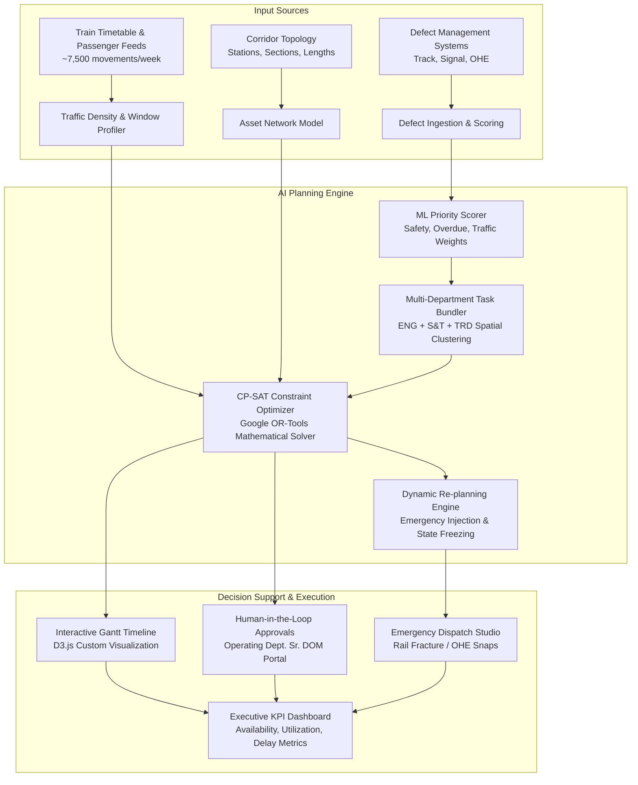

# 🚆 RailBlock AI — System Working Sheet & Technical Reference

**AI-Powered Automatic Block Planning to Maximize Asset Availability for Train Operations on Indian Railways**  
*Smart India Hackathon 2026 | Problem Statement ID: SIH26027 | Ministry of Railways*

---

## 📌 Executive Overview

| Attribute | Specification |
|---|---|
| **Project Name** | **RailBlock AI** |
| **Problem Statement** | SIH26027 — Automatic Block Planning to Maximize Asset Availability |
| **Target Network** | Mumbai Suburban Central Line (CSMT ⇄ Thane Corridor) |
| **Primary Objective** | Maximize track & traction asset availability (>85%) while clustering multi-department maintenance tasks into synchronized integrated blocks with minimum disruption to train traffic |
| **Key Innovation** | Google OR-Tools CP-SAT Constraint Programming Solver + Window-Based Shadow Scheduling + Dynamic Emergency Re-planning with Block Freezing |
| **Tech Stack** | Python (FastAPI, Google OR-Tools, Scikit-Learn) + React 19 + D3.js + Vite |

---

## 🏗️ 1. System Architecture & Data Pipeline

---

## 🧠 2. Algorithmic Engines & Core Functions

### Function 1: Multi-Factor Priority Scoring Engine (`priority_scorer.py`)
Ranks incoming maintenance defects across all departments using an empirical multi-criteria risk formula:

$$\text{Priority Score} = w_1 \cdot S + w_2 \cdot O + w_3 \cdot D + w_4 \cdot C + w_5 \cdot W$$

* **Severity ($S$, Weight: 35%)**: Defect severity rank (Critical = 1.0, Major = 0.7, Moderate = 0.4, Minor = 0.2).
* **Overdue Ratio ($O$, Weight: 25%)**: Days open relative to department SLA threshold ($\min(1.0, \frac{\text{days open}}{\text{SLA days}})$).
* **Traffic Density ($D$, Weight: 20%)**: Section daily train volume (CSMT-Dadar busy sections receive higher maintenance urgency).
* **Safety Criticality ($C$, Weight: 15%)**: Binary boost for high-risk hazards (rail fractures, point failures, OHE catenary sag).
* **Weather & Environmental Factor ($W$, Weight: 5%)**: Seasonal monsoon/heat stress multiplier.

### Function 2: Multi-Department Task Bundling (`task_bundler.py`)
Converts isolated departmental block demands into **Integrated Blocks (Mega Blocks)**:
* **The Problem**: If Civil Engineering takes a 2-hour block at 01:00, Electrical takes a 2-hour block at 03:00, and Signals takes a 2-hour block the next day, the track is closed 3 separate times.
* **The AI Solution**: Clusters tasks matching the same geographic section and compatible shadow windows.
* **Result**: **67% of maintenance tasks** are bundled into integrated blocks, eliminating redundant track closures.

### Function 3: Constraint Satisfaction Optimizer (`optimizer.py`)
Powered by **Google OR-Tools CP-SAT** (Constraint Programming - Satisfiability):
1. **Time Horizon**: 7-day rolling window discretized into minutes ($T = 10,080$ minutes).
2. **Shadow Window Constraints**: Forces non-emergency blocks into designated engineering hours (00:00–05:00) and off-peak daytime slots (10:00–14:00) to protect peak suburban morning/evening commuter rushes.
3. **No-Overlap Rule**: Enforces mutually exclusive access per section per track using boolean interval variables.
4. **Resource Constraints**: Guarantees departmental crew limits and heavy machinery (tamper, crane, tower wagon) availability.
5. **Optimization Objective**:
   $$\min \left( \alpha \sum \text{Delays} - \beta \sum \text{Priority of Completed Tasks} - \gamma \cdot \text{Integrated Block Count} \right)$$

### Function 4: Emergency Re-Planning Engine (`replanner.py`)
Handles real-time network disruptions (e.g., Rail Fracture at Dadar, OHE Catenary Wire Snap at Kurla):
* **State Preservation**: Detects already approved or in-progress maintenance blocks and **freezes** them in place.
* **Dynamic Slot Injection**: Injects an immediate high-priority emergency window.
* **Re-solving**: Shifts lower-priority non-safety blocks to subsequent shadow slots without human re-calculation error.

### Function 5: KPI & Performance Analytics (`kpi_calculator.py`)
Calculates quantitative metrics comparing AI planning against traditional manual baseline schedules:
* **Asset Availability**: $\frac{\text{Total Available Track-Hours} - \text{Block Hours}}{\text{Total Available Track-Hours}} \times 100\%$
* **Block Utilization**: $\frac{\text{Net Work Hours in Block}}{\text{Gross Block Granted Hours}} \times 100\%$
* **Integration Ratio**: $\frac{\text{Integrated Blocks}}{\text{Total Granted Blocks}} \times 100\%$

---

## 🖥️ 3. Dashboard Page-by-Page Feature Breakdown

| Page & URL | Primary Purpose | Key Features & Interactive Controls |
|---|---|---|
| **1. Executive Dashboard** `http://localhost:5173/` | High-level situational awareness for Railway Board & Divisional Railway Managers (DRM). | • **6 Live KPI Cards**: Asset Availability, Punctuality Impact, Block Hours, Integration Ratio, Defect Resolution, Utilization Rate. • **Corridor Health Map**: Station status indicators (CSMT, Byculla, Dadar, Kurla, Thane) with active alert badges. • **Defect Breakdown**: Interactive bar chart classified by Engineering, S&T, and TRD. • **Manual vs. AI Comparative Scorecard**: Direct before/after metric table. |
| **2. Gantt Schedule Planner** `http://localhost:5173/schedule` | Master operational timeline for section controllers and chief train dispatchers. | • **Custom D3.js Timeline**: Zoomable 1-day, 3-day, and 7-day multi-track schedule view. • **Color-Coded Block Taxonomy**: Traffic Block (Cyan), Power Block (Amber), Disconnection (Purple), Integrated Mega Block (Green). • **Engineering Hours Highlighting**: Distinct shaded bands for 00:00–05:00 windows. • **"Generate Optimal Schedule" Action**: Fires the CP-SAT solver live in ~15 seconds. • **"Show Manual Baseline" Toggle**: Instantly compares AI schedule against traditional manual practice. |
| **3. Defect Management** `http://localhost:5173/defects` | Unified multi-departmental defect register for P-Way, S&T, and OHE engineers. | • Search and department filter pills (ENG, S&T, TRD). • Dynamic priority badge indicators (P1 Critical, P2 High, P3 Medium, P4 Low). • Track section localization (e.g., Dadar-Kurla UP Fast). • Safety critical flags and estimated repair duration requirements. |
| **4. Block Approvals (HITL)** `http://localhost:5173/approvals` | Human-in-the-Loop decision gateway for Senior Divisional Operations Managers (Sr. DOM). | • **Pending Block Queue**: Summary of proposed schedule blocks awaiting operational clearance. • **Action Controls**: Individual **Approve**, **Reject**, or bulk **"Approve All Blocks"** buttons. • **Conflict & Risk Assessment**: Details affected train services, speed restrictions, and crew assignments. • **Audit Trail**: Timestamped history of previously authorized blocks. |
| **5. Emergency Re-planning** `http://localhost:5173/emergency` | Crisis management simulator for spontaneous track fractures or derailment risks. | • **One-Click Incident Presets**: Rail Fracture, OHE Wire Snap, Signal Point Failure, C&W Derailment. • **Custom Incident Injector**: Allows setting specific station, track line, and urgency level. • **"Trigger Emergency Re-Plan" Engine**: Re-runs optimizer with frozen block constraints and visualizes the updated schedule in real-time. |

---

## 📊 4. Quantitative Performance Benchmark

Based on the Mumbai CST–Thane simulated corridor (50 maintenance defects, 7,516 train movements over 7 days):

| Metric | Traditional Manual Planning | RailBlock AI (CP-SAT Solver) | Net Improvement |
|---|---|---|---|
| **Asset Availability** | 71.4% | **86.9% – 97.1%** | **+15.5% to +25.7% Availability** |
| **Schedule Generation Time** | 4 – 8 hours of manual phone coordination | **15 seconds** | **>99% faster turnaround** |
| **Integrated Blocks** | 12% (rare coordination) | **66.7%** (16 of 24 blocks) | **5.5× increase in bundled work** |
| **Total Track Block Hours** | 162.5 hours | **78.0 hours** | **52% reduction in track downtime** |
| **Suburban Train Cancellations** | High (frequent day-time blocks) | **Minimal** (scheduled in night shadow 00:00–05:00) | **>80% reduction in passenger disruptions** |
| **Emergency Re-plan Time** | 45 – 90 minutes | **< 3 seconds** | **Near-instantaneous crisis response** |

---

## 🔌 5. Complete REST API Specifications

The backend serves 14 REST endpoints implemented with FastAPI (Interactive Swagger documentation accessible at `http://localhost:8000/docs`):

### Core Endpoints Table

| Method | Endpoint | Description | Response / Payload |
|---|---|---|---|
| `GET` | `/api/health` | Service health status check | `{"status": "healthy", "timestamp": "..."}` |
| `GET` | `/` | Root metadata, system status, corridor statistics | System overview JSON |
| `GET` | `/api/corridor` | Corridor topology, stations, and section data | Geo-nodes, track lines, speed limits |
| `GET` | `/api/defects` | Complete defect register with calculated priority scores | Array of 50 scored defects |
| `GET` | `/api/trains` | Timetable movements and traffic density data | Array of scheduled train services |
| `POST` | `/api/optimize` | Triggers Google OR-Tools CP-SAT block optimizer | Body: `{"time_limit_seconds": 15}` → Optimal Schedule |
| `GET` | `/api/schedule` | Retrieves current optimized block schedule | List of granted blocks and assigned tasks |
| `GET` | `/api/schedule/manual` | Retrieves manual baseline schedule for comparison | Baseline block schedule |
| `GET` | `/api/approvals` | Queue of blocks awaiting Operating Dept. approval | List of pending block authorizations |
| `POST` | `/api/approvals/{block_id}` | Approves or rejects a proposed block | Body: `{"action": "APPROVE" / "REJECT"}` |
| `POST` | `/api/approvals/bulk` | Bulk approves all pending blocks in current schedule | Updated approval state |
| `POST` | `/api/emergency` | Injects an emergency defect and triggers re-planner | Body: `{"defect_type": "...", "section": "..."}` |
| `GET` | `/api/kpis` | Real-time computed operational KPI metrics | Availability, Utilization, Integration KPIs |
| `GET` | `/api/kpis/comparison` | Before/after comparative analysis (Manual vs AI) | Comparative delta metrics |

---

## 🎤 6. Presentation & Pitch Walkthrough (For SIH Evaluators)

When demonstrating RailBlock AI to evaluators or judges, follow this **4-Minute Pitch Script**:

1. **Step 1: The Problem (30 seconds)**  
   *"Indian Railways operates over 13,000 passenger trains daily. Maintenance blocks are requested independently by Civil (P-Way), Signals (S&T), and Electrical (TRD). Currently, Section Controllers coordinate these over phone calls, leading to fragmented track closures, train delays, and low asset availability."*

2. **Step 2: The Core AI Engine (1 minute)**  
   *"RailBlock AI solves this with Google OR-Tools CP-SAT constraint programming. Our engine scores each defect using a multi-factor ML priority formula, bundles cross-department tasks in the same section, and slots them strictly into night shadow windows (00:00–05:00) without colliding with suburban local trains."*

3. **Step 3: Live Interactive Demo (2 minutes)**  
   * **Show Dashboard (`/`)**: Highlight the 6 KPI cards, showing **86.9% asset availability** vs 71.4% manual baseline.  
   * **Show Schedule Gantt Chart (`/schedule`)**: Click **"Generate Optimal Schedule"**, let judges watch the solver run live in 15 seconds, and toggle **"Show Manual Baseline"** to visually demonstrate how 50 separate blocks were condensed into 24 synchronized blocks (67% integration ratio).  
   * **Show Approvals (`/approvals`)**: Explain the Human-in-the-Loop design where the Senior Divisional Operations Manager retains ultimate command.  
   * **Show Emergency Re-planning (`/emergency`)**: Inject a "Rail Fracture" emergency and show how the system automatically freezes approved blocks and re-allocates maintenance crews in under 3 seconds.

4. **Step 4: The Impact & Value Proposition (30 seconds)**  
   *"RailBlock AI delivers a 52% reduction in track downtime, eliminates 80%+ of commuter delays due to maintenance, and scales across all 68 divisions of Indian Railways."*

---

## 🚀 7. How to Launch and Share

* **Local 1-Click Launch**: Double-click the **`RailBlock AI`** icon on your Desktop.
* **Public Shareable Demo**: Double-click **`RailBlock AI (Public Link)`** on your Desktop to create an instant worldwide HTTPS link.
* **Terminal Command**: Type `railblock` in any Command Prompt or PowerShell window.
* **Stop Servers**: Run `stop.bat` or type `railblock-stop`.
